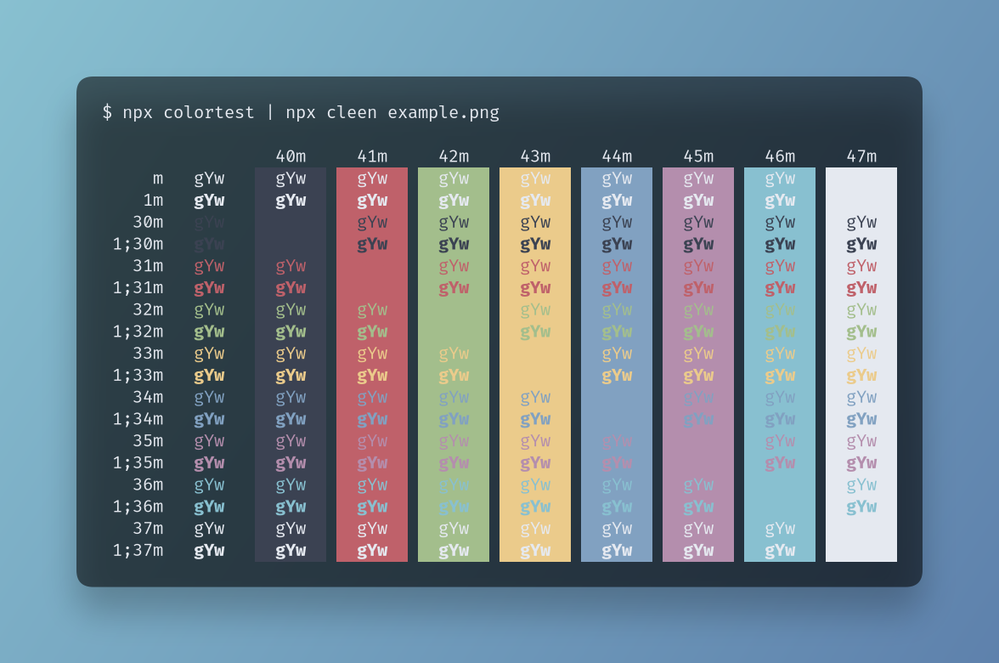

# Cleen

A simple CLI tool to generate awesome screenshots from the terminal



## Usage

Simply pipe any command that outputs information to `cleen`:

```shell
$ some-bash-command | npx cleen [--command "some-bash-command"] [--display] image.png
```

Here's how the README image is generated:

```shell
$ npx colortest | npx cleen --command "npx colortest | npx cleen example.png" example.png
```

You have to give cleen the path of the target picture (Though be careful, as it will overwrite any existing file).

## Options

### `--command <any string of text>`

This will add the specified string at the top of the screenshot as if it was the command that was ran.

### `--display`

This will display the output of the command being piped to cleen in the terminal.
