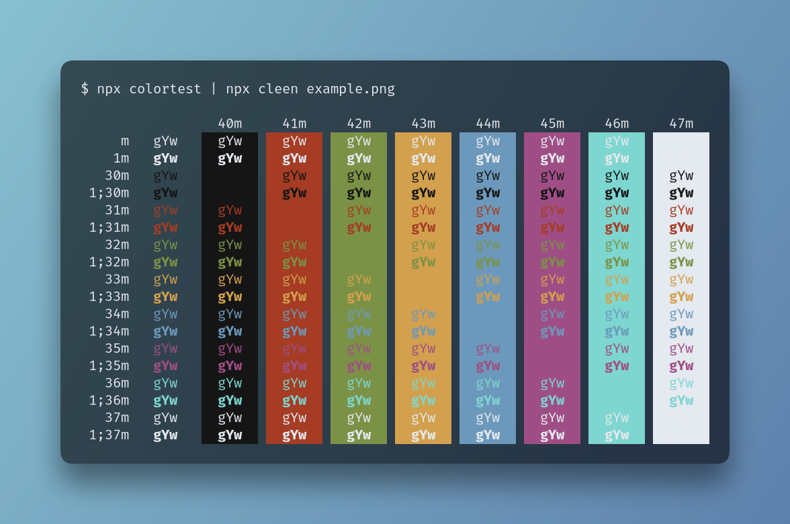

# Cleen

A simple CLI tool to generate awesome screenshots from the terminal



## Usage

Simply pipe any command that ouputs information to `cleen`:

```shell
$ some-bash-command | npx cleen [--command "some-bash-command"] image.png
```

Here's how the README image is generated:

```shell
$ npx colortest | npx cleen --command "npx colortest | npx cleen example.png" example.png
```

You have to give `cleen` the path of the target picture (Though be careful, as it will overwrite any existing file), and you can specify a `--command` to have it display it atop the output.